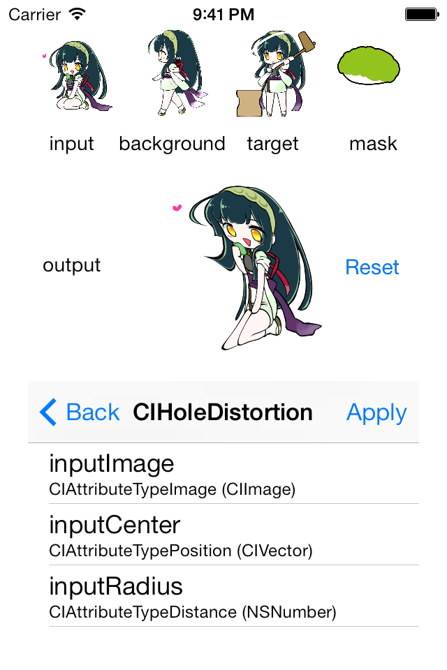

## Welcome to my GitHub Pages

[どんぐりさがし](https://itunes.apple.com/jp/app/o-shou-yan-lian-xi-dongurisagashi/id723602722?mt=8)

[もぐらさがし](https://itunes.apple.com/jp/app/o-shou-yan-lian-xi-mogurasagashi/id723451398?mt=8)

[+8%暗算練習](https://itunes.apple.com/jp/app/+8-an-suan-lian-xi/id723334393?mt=8)

### iOS samples

#### [CALayer](https://github.com/ynaoto/iOSCALayer)
CALayer の振る舞いがなかなか理解できなかったので、学習用に作りました。

#### [Foldable](https://github.com/ynaoto/iOSFoldable)
画像を折り畳んでみたくて作りました。UIImageView の拡張で、設定された画像を上下左右に４分割する QuadImageView、それを折り畳めるようにする FoldableQuadImageView が含まれています。
(画像データは「東北ずん子」サイト様 (http://zunko.jp/) のものを利用させて頂いています。この場を借りて御礼申し上げます)

#### [SKSpriteBlendMode](https://github.com/ynaoto/iOSSKSpriteBlendMode)
iOS 7 よりサポートされている Sprite Kit における SKSpriteNode ではブレンドモードが設定できます。これの動作を理解するために作りました。

#### [CIFilters](https://github.com/ynaoto/iOSCIFilters)
Core Image Filter の学習用サンプルです。
とりあえず inputImage, backgroudImage, targetImage, maskImage を取り扱うようにしました。
他の入力値は追って作ります。
(画像データは「東北ずん子」サイト様 (http://zunko.jp/) のものを利用させて頂いています。この場を借りて御礼申し上げます)

### [Public](http://ynaoto.github.io/public)
### [Privacy Policy](http://ynaoto.github.io/policy/)

### Support or Contact
Naoto Yoshioka yos@pb3.so-net.ne.jp
