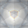

## Welcome to my GitHub Pages

[どんぐりさがし](https://itunes.apple.com/jp/app/o-shou-yan-lian-xi-dongurisagashi/id723602722)

[もぐらさがし](https://itunes.apple.com/jp/app/o-shou-yan-lian-xi-mogurasagashi/id723451398)

[+8%暗算練習](https://itunes.apple.com/jp/app/+8-an-suan-lian-xi/id723334393)

[マンゲカメラ](https://itunes.apple.com/jp/app/mangekamera/id796316390)

### Oculus Quest Apps

#### [NoMeN #1 VR](LinkToOculusStore)
実験ユニット[日々の泡](https://www.youtube.com/channel/UCIiZ61rR8bDM1ZXa8hDx5TA) による映像作品[「NoMeN」#1 『パスタとごはん』](https://www.youtube.com/watch?v=xn189MjfmIY)をVR化してみました。

### P5.js (http://p5js.org/) samples

#### [p5test](p5test.html)
P5.js を試しに使ってみました。ときどきクリックすると面白い動きをします。

### iOS samples

#### [CALayer](https://github.com/ynaoto/iOSCALayer)
CALayer の振る舞い学習用サンプルです。

#### [Foldable](https://github.com/ynaoto/iOSFoldable)
画像を折り畳んでみたくて作りました。

(画像データは「東北ずん子」サイト様 (http://zunko.jp/) のものを利用させて頂いています。この場を借りて御礼申し上げます)

#### [SKSpriteBlendMode](https://github.com/ynaoto/iOSSKSpriteBlendMode)
SKSpriteNode のブレンドモードサンプルです。

#### [CIFilters](https://github.com/ynaoto/iOSCIFilters)
Core Image Filter サンプルです。

とりあえず inputImage, backgroudImage, targetImage, maskImage、NSNumber、CIVector クラスの入力値を取り扱うようにしました。
他の入力値(NSValue等)は、その存在のみを表示します。
(画像データは「東北ずん子」サイト様 (http://zunko.jp/) のものを利用させて頂いています。この場を借りて御礼申し上げます)

#### [CITriangleKaleidoscope](https://github.com/ynaoto/iOSCITriangleKaleidoscope)
CITriangleKaleidoscope のサンプルです。
実機だとそれなりに動きますが、シミュレータだと遅いです(Xcode 5.0.2)。

(画像データは「東北ずん子」サイト様 (http://zunko.jp/) のものを利用させて頂いています。この場を借りて御礼申し上げます)

#### [AudioMeasurement](https://github.com/ynaoto/iOSAudioMeasurement)
マイク入力のとても短いサンプルです。
実機で動きます。シミュレータだと動きません。

#### [SwiftBreakout](https://github.com/ynaoto/SwiftBreakout)
Swift で記述したブロック崩しもどきです。

#### [GlVortex](https://github.com/ynaoto/iOSGlVortex)
GL と Core Image Filter の組み合わせサンプルです。

### [Public](https://github.com/ynaoto/public)
### [Privacy Policy](http://ynaoto.github.io/policy/)

### Support or Contact
Naoto Yoshioka yos@pb3.so-net.ne.jp
